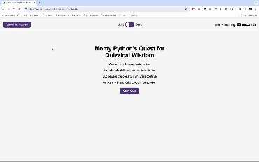

# JavaScript - Homework 3: Code-Quiz
Module 6 Challenge: Code Quiz

## Description

Write a JavaScript program that runs a timed multiple-choice quiz for the user, with a starting time that counts down as soon as the quiz is started.

The app must include the following features/functionality:

* A start button that when clicked a timer starts and the first question appears.

  * Questions contain buttons for each answer.

  * When answer is clicked, the next question appears

  * If the answer clicked was incorrect then subtract time from the clock

* The quiz should end when all questions are answered or the timer reaches 0.

  * When the game ends, it should display their score and give the user the ability to save their initials and their score

### Tasks completed

* When the page is loaded and the 'Start Quiz' button is pressed, the questions will appear one by one, with time being subtracted for incorrect answers. At the end of the quiz their score will be displayed, with the ability to save this score with their intials.

* As an extra, I've added a 'dark mode' option which the user can toggle.

* There's also some hidden Monty Python sound effects if you're either a very good, or very naughty boy. Because you're certainly not the messiah.

### Links

[Link to the deployed website](https://jonnoclifford.github.io/code-quiz/)

[Link to the code repository](https://github.com/jonnoclifford/code-quiz)

## Installation

No installation required - index.html, highscores.html, style.css, all js and sfx files, images and this README pushed to Github.

## Usage

Open website at [https://jonnoclifford.github.io/code-quiz](https://jonnoclifford.github.io/code-quiz) and then play!

## Mock-Up

The following gif shows the web application's appearance and functionality:

## Credits

Supported by Edx teaching staff and multiple websites, YouTube tutorials and forum articles, including:

• Monthy Python Soundboard - https://www.101soundboards.com/boards/11079-monty-python-soundboard

• How To - Toggle Dark Mode: https://www.w3schools.com/howto/howto_js_toggle_dark_mode.asp

• The best light/dark mode theme toggle in JavaScript - Salma Alam-Naylor: https://whitep4nth3r.com/blog/best-light-dark-mode-theme-toggle-javascript/

• Stack Overflow - Storing function in localstorage: https://stackoverflow.com/questions/38926530/javascript-store-function-in-localstorage

• Stack Overflow - Save dark mode in localstorage: https://stackoverflow.com/questions/62047483/save-dark-mode-to-local-storage-in-javascript

• Stack Overflow - How do I retain toggle state across website: https://stackoverflow.com/questions/64652593/how-do-i-retain-toggle-state-across-website

• Stack Overflow - Audio Triggers in Javascript: https://stackoverflow.com/questions/15707745/audio-trigger-in-javascript

• DEV - How to Play Sound on Button Click in JavaScript: https://dev.to/shantanu_jana/how-to-play-sound-on-button-click-in-javascript-3m48

## License

MIT License

Copyright (c) 2023 Jonathan Clifford

Permission is hereby granted, free of charge, to any person obtaining a copy
of this software and associated documentation files (the "Software"), to deal
in the Software without restriction, including without limitation the rights
to use, copy, modify, merge, publish, distribute, sublicense, and/or sell
copies of the Software, and to permit persons to whom the Software is
furnished to do so, subject to the following conditions:

The above copyright notice and this permission notice shall be included in all
copies or substantial portions of the Software.

THE SOFTWARE IS PROVIDED "AS IS", WITHOUT WARRANTY OF ANY KIND, EXPRESS OR
IMPLIED, INCLUDING BUT NOT LIMITED TO THE WARRANTIES OF MERCHANTABILITY,
FITNESS FOR A PARTICULAR PURPOSE AND NONINFRINGEMENT. IN NO EVENT SHALL THE
AUTHORS OR COPYRIGHT HOLDERS BE LIABLE FOR ANY CLAIM, DAMAGES OR OTHER
LIABILITY, WHETHER IN AN ACTION OF CONTRACT, TORT OR OTHERWISE, ARISING FROM,
OUT OF OR IN CONNECTION WITH THE SOFTWARE OR THE USE OR OTHER DEALINGS IN THE
SOFTWARE.
